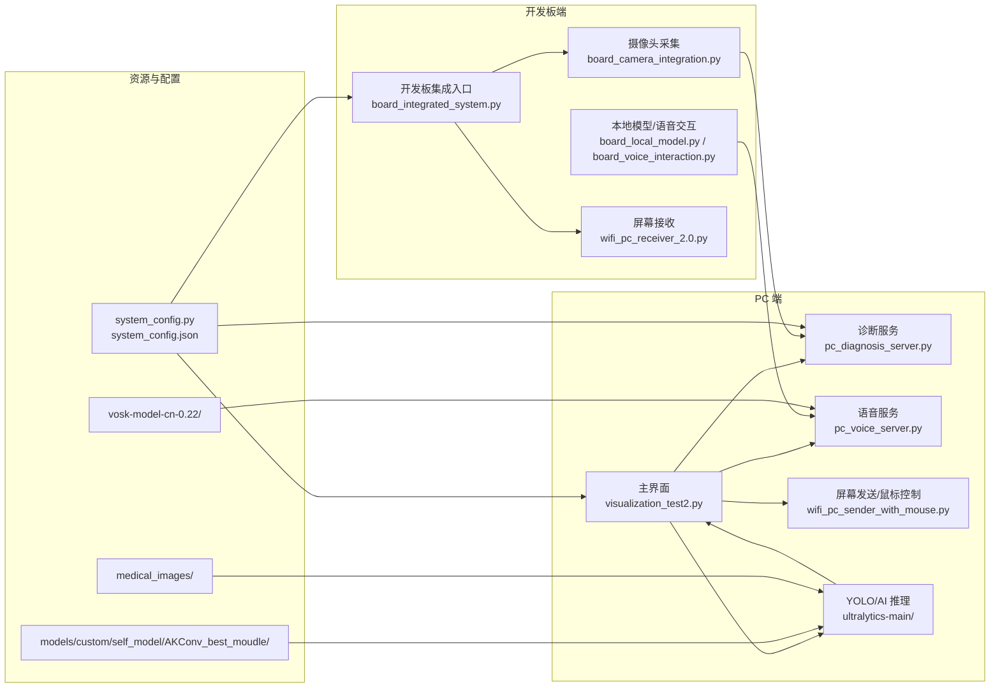
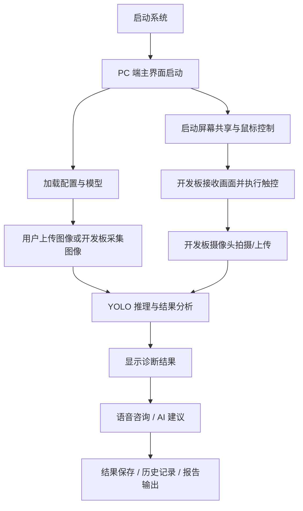

# Intelligent Diagnosis System

<div align="center">

**AI 眼科辅助诊断系统**

一个面向 **PC 端 + 开发板协同** 的眼部图像诊断、语音交互、屏幕联动与网络传输一体化项目。

[快速开始](#-快速开始) · [系统架构](#-系统架构) · [目录说明](#-目录说明) · [使用指南](#-使用指南) · [目录整理说明](#-目录整理说明)

</div>

---

## ✨ 项目简介

本项目聚焦于“**眼部图像智能辅助诊断**”场景，结合 YOLO 视觉推理、中文离线语音识别、局域网通信与开发板联动控制，构建了一个可演示、可部署、可扩展的综合系统。

它适合作为：

- 课程设计 / 毕业设计
- AI 医疗方向原型系统
- PC + 开发板协同教学项目
- 视觉识别 + 语音交互综合实验平台

> 说明：本系统仅用于辅助诊断和教学展示，不能替代专业医生的临床诊断。

---

## 🌟 项目亮点

- **AI 视觉诊断**：基于 YOLO 的眼部图像识别与分析
- **语音交互**：支持中文语音输入、语音识别与 AI 建议
- **双端协同**：PC 端和开发板端分工明确，便于演示和部署
- **屏幕共享与控制**：开发板可接收 PC 画面并回传触摸操作
- **网络通信**：支持局域网内图像、命令和结果传输
- **工程化文档**：仓库中保留了大量使用说明、问题修复和集成文档
- **可答辩展示**：功能链路完整，适合课程汇报和答辩

---

## 🧭 系统架构



---

## 🔄 典型工作流程



---

## 📁 目录结构

```
Intelligent_diagnosis_system/
├── configs/                    # 配置文件
│   ├── system_config.json
│   └── system_config.py
├── data/                       # 数据集目录（预留）
├── docs/                       # 文档
│   ├── guide/                  # 使用指南
│   ├── notes/                  # 开发笔记
│   ├── reports/                # 项目报告
│   └── setup/                  # 环境配置
├── markdown/                   # Markdown文档
├── models/                     # 模型文件
│   └── custom/self_model/AKConv_best_moudle/
├── scripts/                    # 启动脚本
│   ├── jupyter_board_launcher.py
│   ├── quick_start.py
│   ├── simple_start.py
│   ├── start_system.py
│   └── system_launcher.py
├── src/                        # 源代码
│   ├── board/                  # 开发板端代码
│   ├── network/                # 网络通信模块
│   ├── pc/                     # PC端代码
│   ├── utils/                  # 工具函数
│   └── visualization/          # 可视化模块（遗留代码）
├── tests/                      # 测试目录
│   ├── network/                # 网络测试
│   ├── notebooks/              # Jupyter笔记本
│   ├── reports/                # 测试报告
│   ├── scripts/                # 测试脚本
│   └── voice/                  # 语音测试
├── ultralytics-main/           # YOLO框架源码
├── .gitignore
├── LICENSE
├── README.md
└── PROJECT_STRUCTURE.md        # 目录结构文档
```

### 目录说明

| 目录 | 说明 |
|------|------|
| `configs/` | 系统配置文件（JSON和Python） |
| `data/` | 数据集存储目录（预留） |
| `docs/` | 项目文档（指南、笔记、报告、配置说明） |
| `models/` | 训练好的模型文件 |
| `scripts/` | 快速启动脚本 |
| `src/board/` | 开发板端核心代码 |
| `src/network/` | WiFi网络通信模块 |
| `src/pc/` | PC端服务代码 |
| `src/utils/` | 通用工具函数 |
| `src/visualization/` | 可视化模块（遗留代码） |
| `tests/` | 测试代码和报告 |

### 核心文件位置

#### 开发板端 (`src/board/`)
- `board_camera_integration.py`：摄像头采集与上传
- `board_integrated_system.py`：开发板集成入口
- `board_local_model.py`：本地模型推理
- `board_voice_interaction.py`：语音交互
- `start_board.sh`：开发板启动脚本

#### PC端 (`src/pc/`)
- `pc_diagnosis_server.py`：诊断服务
- `pc_voice_server.py`：语音服务

#### 网络通信 (`src/network/`)
- `wifi_pc_sender_with_mouse.py`：PC端屏幕发送与鼠标控制
- `wifi_pc_sender_2.0.py`：PC端发送端
- `wifi_pc_receiver_2.0.py`：开发板接收端
- `wifi1.0/`：旧版脚本归档

#### 工具函数 (`src/utils/`)
- `integration_test.py`、`interaction_test.py`：集成测试
- `test_batch_report.py`：批量报告测试
- `latency_optimizer.py`：延迟优化

#### 可视化模块 (`src/visualization/`)
- `visualization1.0.py` ~ `visualization5.0.py`：历史版本
- `visualization_test.py`、`visualization_test1.py`：测试版本
---

## 🚀 快速开始

### 1）环境要求

#### PC 端
- Python 3.9+
- Windows / Linux / macOS
- 8GB 以上内存更佳
- 可选：CUDA 显卡用于加速推理

#### 开发板端
- Python 3.7+
- 摄像头模块
- 触摸屏或远程操作设备
- 与 PC 处于同一局域网

### 2）安装依赖

使用项目提供的 `requirements.txt` 文件一键安装所有依赖：

```bash
# 安装所有依赖（推荐使用国内镜像加速）
pip install -r requirements.txt -i https://pypi.tuna.tsinghua.edu.cn/simple

# 如果安装失败，可以尝试分步安装
pip install torch torchvision -i https://pypi.tuna.tsinghua.edu.cn/simple
pip install opencv-python numpy PyQt5 -i https://pypi.tuna.tsinghua.edu.cn/simple
pip install ultralytics requests -i https://pypi.tuna.tsinghua.edu.cn/simple
pip install vosk pyttsx3 speechrecognition -i https://pypi.tuna.tsinghua.edu.cn/simple
pip install mss pyautogui psutil matplotlib -i https://pypi.tuna.tsinghua.edu.cn/simple
```

### 3）准备模型与资源

请确认以下目录存在：

- `ultralytics-main/` - YOLO框架源码
- `vosk-model-cn-0.22/` - 中文离线语音识别模型（需单独下载）
- `models/custom/self_model/AKConv_best_moudle/` - 自定义YOLO模型
  - `best.pt` - 最佳权重文件
  - `best.onnx` - ONNX格式模型（用于开发板推理）

#### 数据集结构

项目包含眼部疾病诊断数据集，位于 `data/` 目录：

```
data/
├── eyes_dataset.yaml    # 数据集配置文件
└── eyes_val/            # 验证集（按类别分类）
    ├── A/               # 正常眼
    ├── C/               # 白内障
    ├── D/               # 糖尿病视网膜病变
    ├── G/               # 青光眼
    ├── H/               # 高血压性视网膜病变
    ├── M/               # 黄斑病变
    ├── N/               # 视神经病变
    └── O/               # 其他眼部疾病

```

**数据集类别说明：**

| 类别 | 名称 | 说明 |
|------|------|------|
| A | 正常眼 | 无明显病变 |
| C | 白内障 | 晶状体混浊 |
| D | 糖尿病视网膜病变 | 微血管损伤 |
| G | 青光眼 | 眼压升高 |
| H | 高血压性视网膜病变 | 高血压引起的眼底病变 |
| M | 黄斑病变 | 黄斑区异常 |
| N | 视神经病变 | 视神经损伤 |
| O | 其他眼部疾病 | 其他未分类病变 |

如果你是从 GitHub 克隆而来，但目录为空或缺失，需要手动补齐这些资源。

### 4）配置网络参数

编辑 `configs/system_config.json`，至少确认以下字段：

- `pc_ip` - PC端IP地址
- `board_ip` - 开发板IP地址
- `camera_port` - 摄像头端口（默认5002）
- `diagnosis_port` - 诊断服务端口（默认5003）
- `command_port` - 命令端口（默认5004）
- `screen_port` - 屏幕共享端口（默认5000）
- `control_port`

如果 PC 和开发板 IP 不一致，系统通信会失败。

### 5）启动系统

#### 方式一：一键启动

```bash
python start_system.py
```

#### 方式二：PC 端分步启动

```bash
python src/pc/pc_diagnosis_server.py
python src/pc/pc_voice_server.py
python src/network/wifi_pc_sender_with_mouse.py
```

#### 方式三：开发板端分步启动

```bash
python src/network/wifi_pc_receiver_2.0.py
python src/board/board_camera_integration.py
```

#### 方式四：开发板脚本

```bash
./start_board.sh
```

---

## 🛠️ 使用指南

### A. PC 端主界面怎么用

1. 启动 `scripts/quick_start.py` 或 `scripts/start_system.py`
2. 等待界面加载完成
3. 上传眼部图像或接收开发板传来的图片
4. 点击诊断按钮执行 AI 推理
5. 查看结果、建议和历史记录
6. 需要时可使用语音提问获取辅助说明

### B. 开发板端怎么用

1. 启动开发板侧屏幕接收脚本 `src/network/wifi_pc_receiver_2.0.py`
2. 启动摄像头集成程序 `src/board/board_camera_integration.py`
3. 打开摄像头拍摄眼部图像
4. 将图像上传至 PC 端进行诊断
5. 接收诊断结果并在开发板端查看

### C. 屏幕共享怎么用

1. PC 端启动 `src/network/wifi_pc_sender_with_mouse.py`
2. 开发板端启动 `src/network/wifi_pc_receiver_2.0.py`
3. 连接成功后，开发板会显示 PC 画面
4. 触摸开发板屏幕即可控制 PC 端鼠标

### D. 语音识别怎么用

1. 确保麦克风可用
2. 启动语音相关服务或主界面
3. 按住语音按钮说出问题
4. 系统会优先尝试本地离线识别，再回退到在线识别
5. 输出文字后可进一步获取 AI 建议

---

## ⚙️ 部署说明

### 配置文件

主要配置集中在 `configs/` 目录：

- `configs/system_config.py`
- `configs/system_config.json`

建议先检查：

- 设备 IP 是否正确
- 端口是否冲突
- 网络是否处于同一局域网
- 防火墙是否放行相关端口

### 模型文件

视觉与语音能力依赖以下目录：

- `ultralytics-main/`
- `vosk-model-cn-0.22/`
- `models/custom/self_model/AKConv_best_moudle/`

如果只想运行 UI 而不启用完整 AI 能力，可以先保留目录结构，再逐步补齐资源。

---

## 🧪 测试与调试

整理后的测试目录如下：

- `tests/voice/`：语音功能测试、集成、诊断和使用说明
- `tests/network/`：接口与连接测试
- `tests/scripts/`：脚本类修复与检查工具
- `tests/reports/`：测试报告与修复报告
- `tests/notebooks/`：Notebook 实验文件

如需排查问题，建议优先查看：

- `docs/reports/问题解决报告.md`
- `docs/setup/开发板环境修复指南.md`
- `docs/guide/开发板PC端交互使用说明.md`

---

## 📚 常用文档

- `docs/guide/完整系统使用指南.md`
- `docs/guide/开发板集成系统使用说明.md`
- `docs/guide/开发板PC端交互使用说明.md`
- `docs/guide/开发板AI语音对话功能说明.md`
- `docs/guide/语音对话使用说明.md`
- `docs/setup/百度API配置说明.md`
- `docs/setup/README_NETWORK_SETUP.md`
- `docs/setup/开发板环境修复指南.md`
- `docs/reports/系统优化完成报告.md`
- `docs/reports/项目完成总结.md`

---

## 📁 目录结构说明

### 项目结构概览

```
Intelligent_diagnosis_system/
├── configs/                    # 配置文件
├── data/                       # 数据集目录（预留）
├── docs/                       # 项目文档
├── markdown/                   # Markdown文档
├── models/                     # 模型文件
├── scripts/                    # 启动脚本
├── src/                        # 源代码
│   ├── board/                  # 开发板端代码
│   ├── network/                # 网络通信模块
│   ├── pc/                     # PC端代码
│   ├── utils/                  # 工具函数
│   └── visualization/          # 可视化模块（历史版本）
├── tests/                      # 测试目录
├── ultralytics-main/           # YOLO框架源码
├── requirements.txt            # 依赖配置文件
├── visualization_test2.py      # 主入口文件
├── PROJECT_STRUCTURE.md        # 目录结构文档
└── README.md
```

### 建议保留
- 核心业务文件（`src/` 目录）
- 网络传输脚本（`src/network/`）
- 配置文件（`configs/`）
- 测试脚本（`tests/`）
- 文档与答辩资料（`docs/`）
- 许可证文件（`LICENSE`）
- `src/visualization/` 中的旧版本代码（仅作为历史参考）
- `models/custom/self_model/AKConv_best_moudle/` 中的自定义模型
- `requirements.txt` 依赖配置文件

### 建议忽略（添加到 .gitignore）
- `.idea/`
- `.vscode/`
- `.history/`
- `.claude/`
- `__pycache__/`
- `*.pyc`
- `saved_api_key.txt`
- `.env`
- `.env.*`
- `temp_image_*.png`
- `network_config.json`

### 建议迁移到外部管理（大文件）
- `vosk-model-cn-0.22/` - 中文语音模型（约1.5GB）
- 超大模型文件：`.pt`、`.mdl`、`.fst`、`.carpa`
- 如果 `ultralytics-main/` 只是依赖，建议改为 pip 安装
- 如果 `ultralytics-main/` 只是依赖，建议改为 pip 安装；如果包含本地修改，再考虑保留必要部分

### 建议进一步重构
- 把大脚本拆分成 `ui/`、`services/`、`network/`、`config/` 等模块
- 将主入口逐步迁移到更语义化的名字，例如 `main_app.py`
- 测试脚本按功能归类到更清晰的目录
- 旧版可继续放在 `legacy/` 中，不再参与主流程

---

## 🔒 安全提醒

- 不要把 API Key、账号密码等敏感信息提交到仓库
- 不要把本地编辑器缓存和历史文件提交到仓库
- 如果已经提交过敏感信息，请立即轮换密钥并清理 Git 历史

---

## 📄 许可证

本项目采用 MIT 许可证，详见 `LICENSE`。